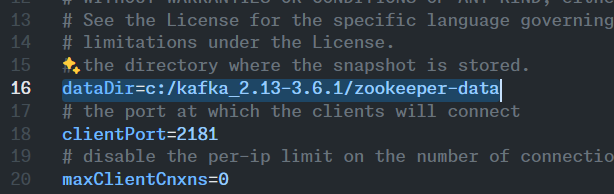
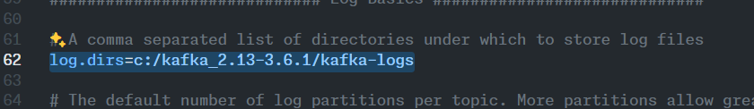

# How to setup the project

## Prerequisites

- Java 17 or later

## Steps

### install apache kafka

- Download the latest version of Apache Kafka from [here](https://kafka.apache.org/downloads)
- Extract the downloaded file to a directory of your choice

change the config file `zookeeper.properties`



change the config file `server.properties`



this completes the setup of Apache Kafka

### run the project

in the root directory of the project, run the following command

```powershell
.\bin\windows\zookeeper-server-start.bat .\config\zookeeper.properties
```

```powershell
.\bin\windows\kafka-server-start.bat .\config\server.properties
```

to get the graphical user interface for Apache Kafka, run the following command

<https://akhq.io/>

```powershell
C:\kafkaUI>C:\Users\USER\.jdks\corretto-21.0.2\bin\java.exe -Dfile.encoding=windows-1252 -Dsun.stdout.encoding=windows-1252 -Dsun.stderr.encoding=windows-1252 -jar C:\kafkaUI\akhq-0.24.0-all.jar
```

### create a spring boot project