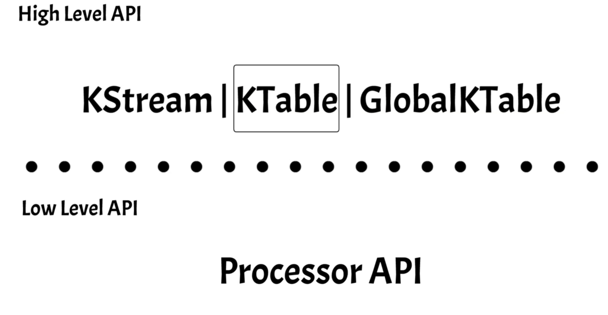
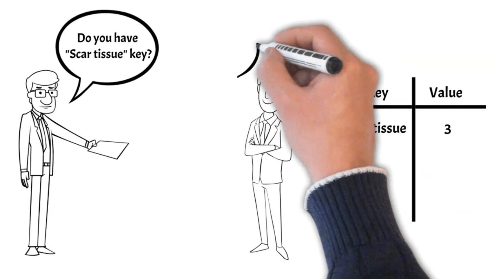
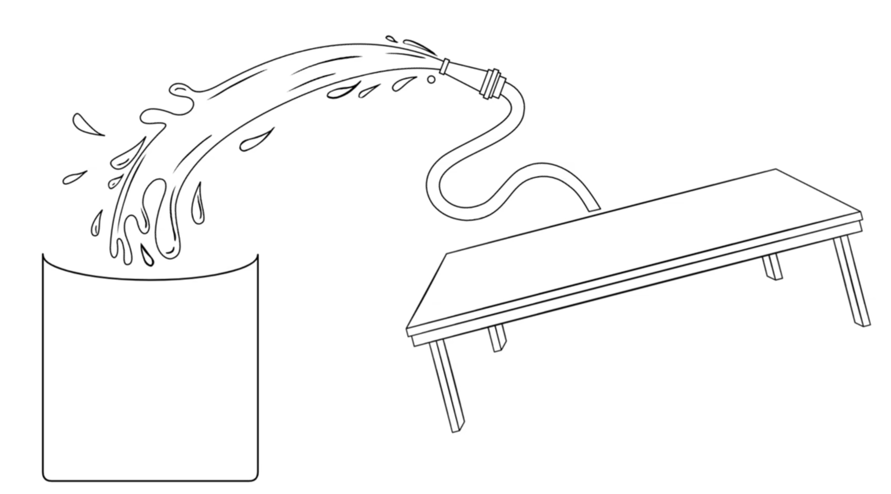

# kafka stream - getting started

## 1. Kafka Streams vs. Regular Kafka

Kafka Streams is a library that allows you to perform stream processing on data stored in Kafka. It is a client library for building applications and microservices, where the input and output data are stored in Kafka clusters. Kafka Streams is a part of the Apache Kafka project and is used for building real-time applications and microservices.


what is a kafka consumer?

A Kafka consumer is a client that subscribes to topics and processes the feed of published messages. Kafka consumers are used to read messages from Kafka topics and process them. Kafka consumers can be used to read messages from one or more Kafka topics and process them.

what is a kafka stream?

Kafka Streams is a client library for building applications and microservices, where the input and output data are stored in Kafka clusters. It is a part of the Apache Kafka project and is used for building real-time applications and microservices. Kafka Streams is a library that allows you to perform stream processing on data stored in Kafka.


## 2. Topology


## 3. Topology - Hands-on


```java
package com.wchamara.kafkasampleapp.topology;

import org.apache.kafka.streams.StreamsBuilder;
import org.apache.kafka.streams.Topology;
import org.springframework.context.annotation.Bean;
import org.springframework.stereotype.Component;

@Component
public class BasicTopology {
    @Bean
    public Topology createTopology() {
        StreamsBuilder builder = new StreamsBuilder();

        // Add your topology here

        return builder.build();
    }
}

```

## 4. Serdes


example

custom serdes


we can make our own custom serializer and deserializer


## 5. Serdes - Hands-on

```java
package com.wchamara.kafkasampleapp.topology;

import com.google.gson.Gson;
import com.wchamara.kafkasampleapp.dto.MovieQuotes;
import com.wchamara.kafkasampleapp.util.KufkaSerdisUtil;
import org.apache.kafka.common.serialization.Serdes;
import org.apache.kafka.streams.StreamsBuilder;
import org.apache.kafka.streams.Topology;
import org.apache.kafka.streams.kstream.Consumed;
import org.apache.kafka.streams.kstream.KTable;
import org.apache.kafka.streams.kstream.Materialized;

//@Component
public class KTableTopology {
    Gson gson = new Gson();

    //    @Bean
    public Topology createTopology() {
        StreamsBuilder builder = new StreamsBuilder();
        Materialized materialized = Materialized.as("movies-quotes");
        Materialized materializedWithDefault = Materialized.as("movies-quotes-with-default");

        KTable simpleConsumerDefault = builder.table("star-wars-quotes");
        KTable matierializedConsumerDefault = builder.table("disney-quotes", materializedWithDefault);
        KTable<String, MovieQuotes> simpleConsumer = builder.table("arnold-schwarzenegger-quotes", Consumed.with(Serdes.String(), KufkaSerdisUtil.getSerde(MovieQuotes.class, gson)));
        KTable matierializedConsumer = builder.table("basketball-quotes", Consumed.with(Serdes.String(), Serdes.String()), materialized);

        simpleConsumerDefault.toStream().to("simpleConsumerDefault");
        matierializedConsumerDefault.toStream().to("matierializedConsumerDefault");
        simpleConsumer.toStream().to("simpleConsumer");
        matierializedConsumer.toStream().to("matierializedConsumer");

        return builder.build();
    }
}

```

## 6. Tasks


Doors are the tasks
which is 3 in this case

taxis are the threads


## 7. DSL vs. PAPI


## 8. KStream


## 9. KStream - Hands-on

## 10. KTable











## 11. KTable -  Hands-on

## 12. GlobalKTable


## 13. GlobalKTable - Hands-on

```java
package com.wchamara.kafkasampleapp.topology;

import org.apache.kafka.common.serialization.Serdes;
import org.apache.kafka.streams.StreamsBuilder;
import org.apache.kafka.streams.Topology;
import org.apache.kafka.streams.kstream.Consumed;
import org.apache.kafka.streams.kstream.GlobalKTable;
import org.apache.kafka.streams.kstream.Materialized;

//@Component
public class GlobalKTableTopology {
    //    @Bean
    public Topology createTopology() {
        StreamsBuilder builder = new StreamsBuilder();
        Materialized materialized = Materialized.as("movies-quotes");
        Materialized materializedWithDefault = Materialized.as("movies-quotes-with-default");

        GlobalKTable simpleConsumerDefault = builder.globalTable("star-wars-quotes");
        GlobalKTable matierializedConsumerDefault = builder.globalTable("disney-quotes", materializedWithDefault);
        GlobalKTable simpleConsumer = builder.globalTable("arnold-schwarzenegger-quotes", Consumed.with(Serdes.String(), Serdes.String()));
        GlobalKTable matierializedConsumer = builder.globalTable("basketball-quotes", Consumed.with(Serdes.String(), Serdes.String()), materialized);

//        simpleConsumerDefault.toStream().to("simpleConsumerDefault");
//        matierializedConsumerDefault.toStream().to("matierializedConsumerDefault");
//        simpleConsumer.toStream().to("simpleConsumer");
//        matierializedConsumer.toStream().to("matierializedConsumer");

        return builder.build();
    }
}
```

## 14. Processor (PAPI)

## 15. Processor (PAPI) - Hands-on

## 16. State store

## 17. Re-partition
